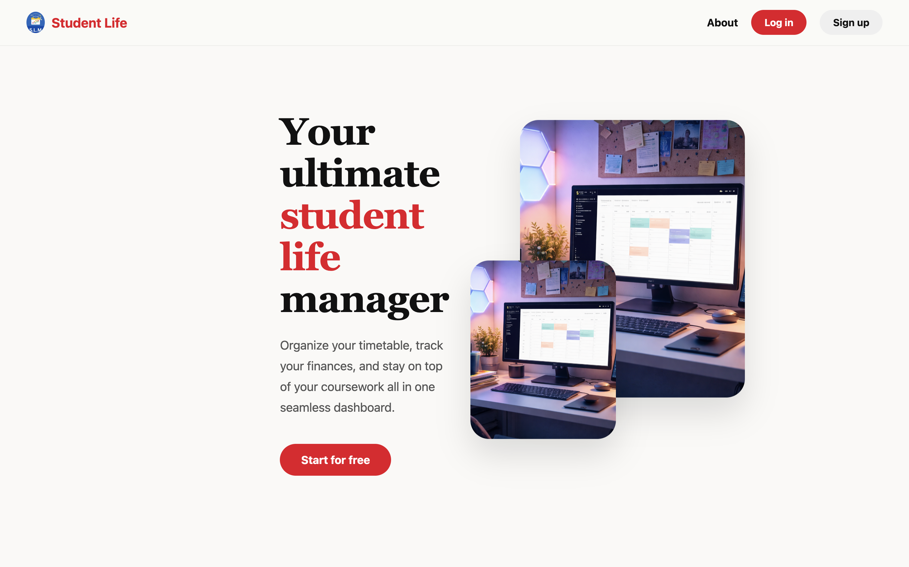

# ELEE1149 – Student Life Management System

<div align="center">

  <a href="https://www.python.org/">
    
  </a>
  <a href="https://react.dev/">
    
  </a>
  <a href="https://vitejs.dev/">
    
  </a>

<br> 


<br><br> 

</div>

---

> **A web-based system designed to support students in managing academic, financial, and personal responsibilities in one unified platform.**

---

## Table of Contents

- [About the Project](#about-the-project)
- [Features](#features)
- [Tech Stack](#tech-stack)
- [Getting Started](#getting-started)
  - [Prerequisites](#prerequisites)
  - [Installation](#installation)
- [Usage](#usage)
- [Screenshots](#screenshots)
- [Project Structure](#project-structure)
- [Documentation](#documentation)
- [Contributors](#contributors)
- [License](#license)

## About the Project

This project is a Student Life Management System, developed as part of the ELEE1149 Software Engineering module. The system provides students with a centralised platform to manage key aspects of university life, including:

- Academic modules and grades
- Timetables and deadlines
- Task management
- Personal budgeting and expenses

### Problem it Solves

Students often use multiple disconnected tools (notes apps, calendars, spreadsheets), which leads to:

- Poor organisation
- Missed deadlines
- Lack of visibility over workload and finances

This system solves that by integrating all features into one structured application, improving productivity and reducing stress.

### Target Users

- University students
- Individuals managing multiple responsibilities
- Users who need a simple and structured productivity tool

## Features

### Core Features

The system was developed based on defined functional and non-functional requirements, ensuring alignment between user needs and implementation.

| Feature Area        | Description                                                                                  |
| ------------------- | -------------------------------------------------------------------------------------------- |
| User Account System | Secure login and account creation with password validation and reset functionality           |
| Dashboard           | Central overview displaying tasks, deadlines, and workload indicators with real-time updates |
| Task Management     | Create, edit, delete, and prioritise tasks, with completion tracking                         |
| Deadline Tracking   | Manage deadlines with automatic sorting and visual indicators for overdue and upcoming items |
| Module Management   | Record modules and assessment results with automatic average calculation                     |
| Budget Management   | Track income and expenses with categorisation and real-time balance updates                  |

## Tech Stack

- Frontend: HTML, CSS, TypeScript 5.9, React 19, Vite 8, Recharts
- Backend: Python 3.12, Flask 3, Flask-CORS
- Data Storage: JSON flat files
- Authentication: pyJWT, bcrypt
- Version Control: Git & GitHub
- Development Tools: VS Code, GitHub Classroom,
- Linting: ESLint 9, Prettier, flake8, Black

## Getting Started

### Prerequisites

- Python 3.12 or higher
- Node.js 20 or higher
- npm 10 or higher
- A Gmail account with an App Password configured (for OTP email)
- Git

### Installation

See [Backend README](./Backend/README.md#setup) and [Frontend README](./Frontend/README.md#setup-instructions)

### Usage

You need two terminals running simultaneously

Terminal 1: Start the backend:

```bash
cd Backend
source myenv/Scripts/activate # for windows Git Bash
python main.py
# Running on http://127.0.0.1:5000
```

Terminal 2: Start the frontend:

```bash
cd Frontend
npm run dev
# Local: http://localhost:5173
```

Open http://localhost:5173 in your browser.

## Screenshots

_Add screenshots or GIFs to showcase the UI or functionality._

### Project Structure

_Example format below_

```
elee1149-courswork-2025-a-s-s-a/
├── Backend/                   # Flask REST API and data logic
│   ├── data/                  # JSON files for persistent storage
│   ├── models/                # Data classes (Academics, Budget, User)
│   ├── services/              # Coordination layer between models and routes
│   ├── storage/               # Thread-safe JSON storage management
│   ├── tests/                 # Full backend test suite
│   ├── main.py                # Main Flask entry point and API routes
│   ├── requirements.txt       # Python backend dependencies
│   └── .flake8                # Backend linting configuration
│
├── Frontend/                   # React 19 & TypeScript SPA
│   ├── public/                # Static assets (Logos, Team images)
│   ├── src/
│   │   ├── reactpage/         # Core application pages and components
│   │   ├── services/          # API client and LocalStorage management
│   │   ├── styles/            # Modular CSS themes (Classic, Light, Dark)
│   │   ├── App.tsx            # Protected routing and component map
│   │   └── main.tsx           # React DOM rendering entry point
│   ├── package.json           # Frontend dependencies and scripts
│   └── vite.config.ts         # Vite build tool configuration
│
└── README.md                   # Main project documentation
```

## Documentation & Reflection

The full engineering process is documented in the following files:

- Requirements: See Requirements.md for Functional & Non-Functional mapping.

- System Modelling: See SystemModelling.md for UML and Architectural decisions.

- AI Reflection: See AI-Reflection.md for evaluation of LLM usage during the SDLC.

## Contributors

- [A9rlt](https://github.com/A9rlt) - Lead Back End Developer
- [AbishilS](https://github.com/AbishilS) - Lead Front End Developer
- [declaringintent](https://github.com/declaringintent) – Lead Back End Developer
- [Tomas-l-santos](https://github.com/Tomas-l-santos) - Lead Front End Developer

## License

Distributed under the **MIT License**. See the [LICENSE](./License) file for more information.
