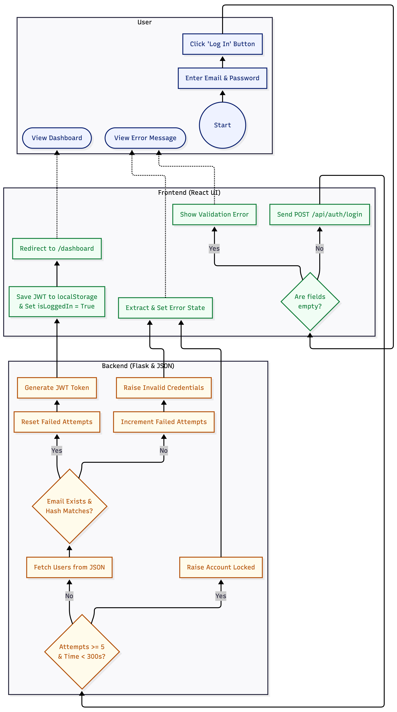
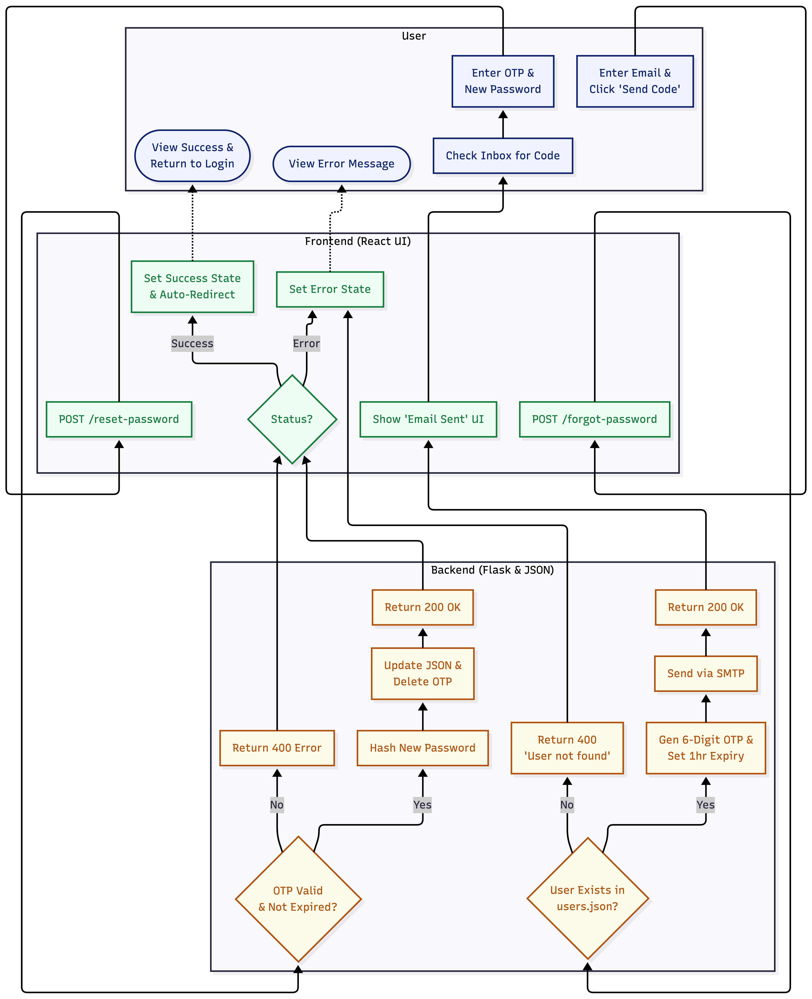
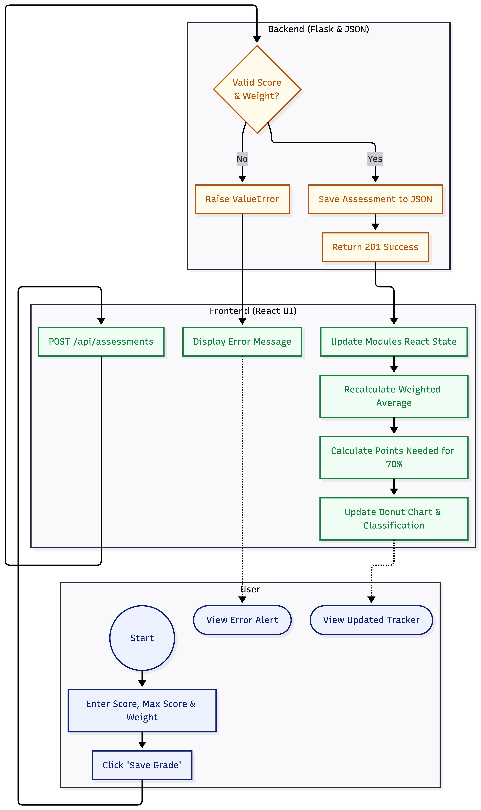
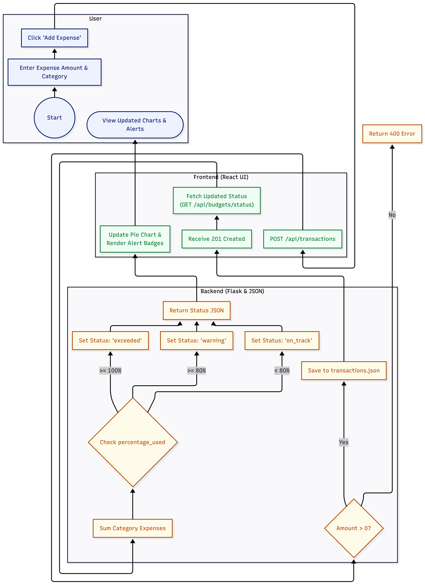
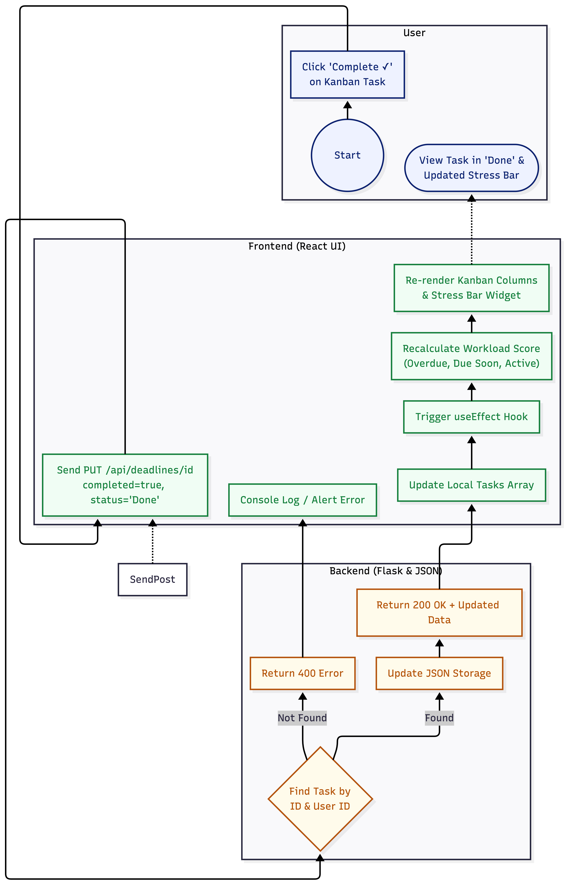

# System Modelling (Activity Diagrams)

## 1 Introduction

This section details the behavioral logic of the Student Life Management system. The following activity diagrams utilize swimlanes to separate concerns between the user, the client-side React application, and the Flask server. This architectural visualization demonstrates how the system maintains state and enforces security constraints across the full stack.

## 1.1 User Authentication and Security Lockout

This diagram illustrates the application’s access control workflow, from entering credentials to generating a JSON Web Token (JWT). It also emphasizes the defensive measures used to enforce NFR-2, where authorisation.py tracks failed_attempts to mitigate brute-force attacks.

**_Related Requirements: UR-1, SR-1.3, US-4, NFR-2_**

| Authentication Activity Diagram |
| ------------------------------- |
|    |

Logic Overview:

- Validation: The client checks for empty fields before sending a request.
- Security Gate: The backend monitors failed login attempts. If there are 5 or more failures within 5 minutes (300 seconds), the account is
  temporarily locked.
- Persistence: On a successful login, the JWT is saved in localStorage to maintain the session.

## 1.2 Password Recovery (OTP) Workflow

This workflow shows how the system handles password recovery via OTP, integrating with external SMTP services. The process is asynchronous: the system responds to the user immediately while sending the email securely in the background.

**_Related Requirements: SR-1.4, SR-1.5, US-3_**

| Password Recovery Activity Diagram    |
| ------------------------------------- |
|  |

Logic Overview:

- User Validation: The system checks users.json for the provided email. If the email does not exist, it returns a 400 Bad Request with the message “User not found,” allowing the user to correct their input.
- Temporal Logic: OTPs expire 3600 seconds (1 hour) after issuance. The verify_reset_token function in authorisation.py compares the current time against the stored expiry timestamp before permitting a password reset.
- Secure Cleanup: To prevent reuse, the OTP is immediately removed from server memory following a successful password update.

## 5.3 Academic Grade & Distinction Calculation

This workflow illustrates the distinction calculation process. The backend ensures that submitted scores do not exceed the maximum allowed, while the frontend React engine performs real-time calculations to determine the student’s UK degree classification.

**_Related Requirements: US-6, US-7, US-8, SR-3.4_**

| Academic Performance Activity Diagram |
| ------------------------------------- |
|      |

Logic Overview:

-Weighted Calculation: Each assessment’s contribution is computed as:
Contribution = (Score/Max Score) × Weight
-Reactive UI: The frontend’s "useMemo" hook updates the Donut Chart automatically whenever the assessment array changes

## 5.4 Financial Transaction & Budget Alerting

This workflow illustrates budget monitoring with conditional branching based on spending thresholds. It supports NFR-6 by providing immediate visual feedback to the user regarding their financial status.

**_Related Requirements: UR-2, SR-2.2, SR-2.7, US-11, US-12_**

| Financial Management Activity Diagram |
| ------------------------------------- |
|        |

Logic Overview:

- Two-Phase Communication: The system first sends a POST request (Command) and then performs a GET request (Query) to refresh the current budget status.
- Threshold Gates: The "percentage_used" is evaluated to determine alerts:
  - ≥ 80% triggers a Warning state
  - ≥ 100% triggers an Exceeded state

## 5.5 Kanban Task & Workload Evaluation

Related Requirements: US-18, US-20, SR-4.3

This workflow illustrates the interaction between the Kanban task board and the Workload Stress indicator. It shows how a state change in a single component automatically triggers a recalculation of the user’s overall productivity metrics.

| Task Management Activity Diagram |
| -------------------------------- |
|       |

**_Related Requirements: UR-4, SR-4.3, SR-4.4, US-18, US-20_**

Logic Overview:

- Ownership Verification: The backend ensures that the user_id in the JWT matches the user_id of the task owner stored in JSON before allowing any updates.
- Global State Update: Moving a task to “Done” triggers the frontend’s useEffect hook, which recalculates remaining active deadlines and updates the Stress Bar color accordingly.
