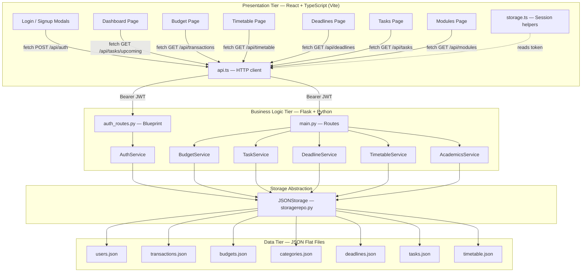

```mermaid
graph TB
    subgraph Presentation ["Presentation Tier — React + TypeScript (Vite)"]
        A[Login / Signup Modals]
        B[Dashboard Page]
        C[Budget Page]
        D[Timetable Page]
        E[Deadlines Page]
        F[Tasks Page]
        G[Modules Page]
        H[api.ts — HTTP client]
        I[storage.ts — Session helpers]
    end

    subgraph Business ["Business Logic Tier — Flask + Python"]
        J[auth_routes.py — Blueprint]
        K[main.py — Routes]
        L[AuthService]
        M[BudgetService]
        N[TaskService]
        O[DeadlineService]
        P[TimetableService]
        Q[AcademicsService]
    end

    subgraph Data ["Data Tier — JSON Flat Files"]
        R[users.json]
        S[transactions.json]
        T[budgets.json]
        U[categories.json]
        V[deadlines.json]
        W[tasks.json]
        X[timetable.json]
    end

    subgraph Storage ["Storage Abstraction"]
        Y[JSONStorage — storagerepo.py]
    end

    A -->|fetch POST /api/auth| H
    B -->|fetch GET /api/tasks/upcoming| H
    C -->|fetch GET /api/transactions| H
    D -->|fetch GET /api/timetable| H
    E -->|fetch GET /api/deadlines| H
    F -->|fetch GET /api/tasks| H
    G -->|fetch GET /api/modules| H

    H -->|Bearer JWT| J
    H -->|Bearer JWT| K

    J --> L
    K --> M
    K --> N
    K --> O
    K --> P
    K --> Q

    L --> Y
    M --> Y
    N --> Y
    O --> Y
    P --> Y
    Q --> Y

    Y --> R
    Y --> S
    Y --> T
    Y --> U
    Y --> V
    Y --> W
    Y --> X

    I -.->|reads token| H
```