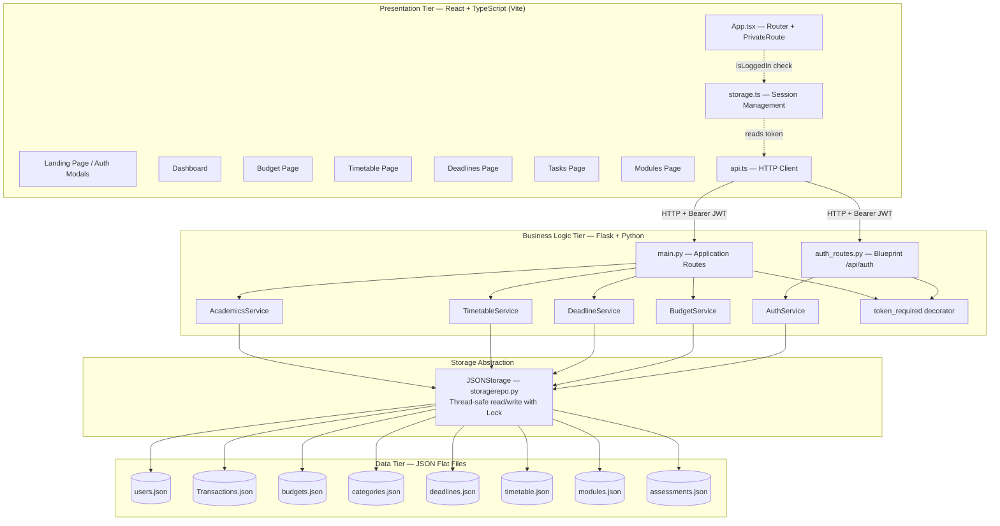

# System Architecture

## 1. Overview

Architectural design is concerned with understanding how a software system should be organised and designing the overall structure of that system. It is the critical link between design and requirements engineering, identifying the main structural components and the relationships between them. The output is an architectural model that describes how the system is organised as a set of communicating components.

Student Life Management (SLM) is structured as a three-tier client-server architecture. The three tiers - presentation, business logic, and data - each have a single, well-defined responsibility and communicate with adjacent tiers through explicit interfaces. The frontend communicates with the backend exclusively via HTTP REST requests carrying JSON payloads. The backend communicates with storage exclusively via the `JSONStorage` abstraction class. Neither the frontend nor the storage layer has any knowledge of each other.

## 2. High-Level Architecture Diagram

## 3. Component Breakdown

### Presentation Tier
**Technology:** React 19, TypeScript 5.9, Vite 8, Recharts

The frontend is a single-page application (SPA). All navigation is handled client-side by React Router — the server only ever serves one HTML file. `App.tsx` defines all routes and wraps protected pages in a `PrivateRoute` component that redirects unauthenticated users to the landing page.

All HTTP communication is centralised in `api.ts`. This is the only file that constructs fetch requests — page components never call `fetch` directly. `storage.ts` manages the browser session, saving the JWT, email, and username to localStorage on login and clearing them on logout.

The `Sidebar` and `Topbar` components are defined in `dashboard.tsx` and exported to all dashboard pages, ensuring consistent navigation and theme behaviour across the application.

**Component responsibilities:**

| Component | Responsibility |
|-----------|---------------|
| `App.tsx` | Route definitions, PrivateRoute authentication guard |
| `Signup.tsx` | Login and registration modal components |
| `ForgotPassword.tsx` | 3-step OTP password reset (request → verify → success) |
| `dashboard.tsx` | Shared Sidebar and Topbar; main dashboard view |
| `budget.tsx` | Transaction forms, income/expense pie charts, summary cards |
| `timetable.tsx` | Weekly grid with time-positioned, colour-coded entries |
| `deadlines.tsx` | Deadline table with priority, status, notes, stress indicator |
| `tasks.tsx` | Task list with priority sorting and completion tracking |
| `modules.tsx` | Module tracker with weighted assessment score calculation |
| `about.tsx` | Team information and project landing page |
| `api.ts` | All fetch calls to the backend API |
| `storage.ts` | localStorage session helpers |

### Business Logic Tier
**Technology:** Python 3.12, Flask 3, Flask-CORS, PyJWT, bcrypt, python-dotenv

The backend is a stateless REST API. Authentication routes are grouped into a Flask Blueprint (`auth_bp`) registered at `/api/auth`. All other routes are defined in `main.py`. The `@token_required` decorator intercepts every protected request, validates the JWT from the `Authorization` header, and injects the authenticated user's email and UUID into the route function. No route function performs its own token handling.

Each feature area has a dedicated service class. Routes are intentionally thin — they parse the HTTP request, delegate to the service, and return the result as JSON. All business logic, validation, and data manipulation lives in the service layer.

`AcademicsService` acts as a facade that coordinates four domain classes: `Modules`, `Assessments`, `AcademicAnalytics`, and `Notes`, each of which manages its own storage file.

**Service components:**

| Component | Responsibility |
|-----------|---------------|
| `AuthService` | User registration, login, password hashing, lockout, OTP generation and verification |
| `BudgetService` | Transaction and budget CRUD, category initialisation, spending summaries |
| `DeadlineService` | Deadline CRUD with priority, status (To-Do/In Progress), and notes fields |
| `TimetableService` | Timetable entry CRUD with day, time, and date range fields |
| `AcademicsService` | Facade coordinating Modules, Assessments, AcademicAnalytics, Notes |
| `token_required` | JWT decorator that extracts and validates auth on every protected route |
| `generate_token` | Creates a JWT payload containing email, user_id, and 24-hour expiry |

### Storage Abstraction
**Technology:** Python standard library (`json`, `os`, `threading`)

`JSONStorage` in `storagerepo.py` is the only component that reads from or writes to disk. It provides four operations: `read_all`, `write_all`, `append`, and `overwrite`. A `threading.Lock` prevents race conditions when multiple requests attempt to read and write the same file concurrently.

Every service instantiates `JSONStorage` with a specific file path. If the file does not exist, `JSONStorage` creates it automatically as an empty array.

### Data Tier
**Technology:** JSON flat files

| File | Model Class | Contents |
|------|------------|---------|
| `users.json` | `User` | Accounts: user_id (UUID), email, username, bcrypt password hash, birthdate |
| `Transactions.json` | `Transaction` | Financial records: user_id, category_id, amount, description, date |
| `budgets.json` | `Budget` | Monthly budget limits: user_id, category_id, amount, month, year |
| `categories.json` | *(dict)* | 16 predefined categories: 11 expense, 5 income — initialised automatically |
| `deadlines.json` | `Deadline` | Deadlines: user_id, title, module_name, due_date, priority, status, notes |
| `timetable.json` | `TimetableEntry` | Classes: user_id, module_name, location, type, day, times, date range |
| `modules.json` | `Modules` | Academic modules: user_id, name, code, credits, year, academic_year |
| `assessments.json` | `Assessments` | Assessment results: module_id, name, type, score, max_score, weight |

**Note on data model field detail:**

The `Deadline` model includes `status` ("To-Do", "In Progress") and `notes` in addition to the standard `priority` and `completed` fields, allowing richer deadline tracking. `TimetableEntry` includes `start_date` and `end_date` to support recurring weekly entries over a date range.

## 4. Security decisions

| Decision | Implementation | Justification |
|----------|---------------|---------------|
| Password hashing | bcrypt with auto-generated salt | Resistant to rainbow table attacks |
| Token format | JWT with HS256 signing | Stateless — server holds no session state |
| Token expiry | 24 hours | Balances security with usability |
| Account lockout | 5 attempts, 5-minute window | Mitigates brute-force attacks |
| User identity in routes | Extracted from JWT only | Email never appears in URL or request body |
| Secrets management | `.env` file, excluded from version control | Prevents credential leakage via git history |
| OTP generation | Python `secrets` module, 6 digits, 1-hour expiry | Cryptographically secure, single-use |

## 5. Design Patterns

| Pattern | Location | Purpose |
|---------|----------|---------|
| **Blueprint** | `auth_routes.py` | Groups all auth routes under `/api/auth`, keeping `main.py` uncluttered and auth logic self-contained |
| **Service Layer** | `budget_service.py`, `deadline_service.py`, `timetable_service.py`, `academics_service.py` | Separates business logic from HTTP concerns — routes are thin, services are independently testable |
| **Repository** | `storagerepo.py` (JSONStorage) | Abstracts all file I/O behind a consistent 4-method interface — storage backend can be swapped without changing any service |
| **Decorator** | `@token_required` in `auth_routes.py` | Adds JWT validation to any route without modifying the route function — applied uniformly across all protected endpoints |
| **Facade** | `AcademicsService` | Provides a single unified interface to four underlying domain classes (Modules, Assessments, AcademicAnalytics, Notes), hiding internal coordination from the routes layer |
| **Value Object** | `to_dict()` / `from_dict()` on all model classes | Each model serialises and deserialises itself — no external mapping logic, and the JSON representation is always consistent with the model definition |
| **Shared Component** | `Sidebar`, `Topbar` exported from `dashboard.tsx` | Defined once, reused across all dashboard pages — theme changes and navigation updates propagate automatically |

---

## 6. Technology Justification

| Technology | Justification |
|------------|---------------|
| **Flask** | Lightweight with minimal boilerplate — routes can be added incrementally. No ORM or configuration overhead. Blueprint support allows logical grouping of auth routes |
| **React + TypeScript** | Component reuse (`Sidebar`, `Topbar`) across all pages. TypeScript catches type errors at compile time rather than silently at runtime |
| **Vite** | Significantly faster dev server startup than Create React App, with native TypeScript and ES module support |
| **JWT** | Stateless authentication — the server holds no session data, simplifying the backend and making the API inherently scalable |
| **bcrypt** | Industry-standard password hashing with built-in salting — safer than SHA or MD5 alternatives |
| **Recharts** | React-native charting library with clean TypeScript integration, renders charts as React components that respond to state changes |
| **JSON flat files** | No database server required — the application runs entirely locally. The `JSONStorage` abstraction means this can be replaced with SQLite or PostgreSQL without changing any service code |
| **GitHub Actions** | Free for public repositories, integrates with the existing GitHub workflow, provides CI pipeline feedback directly on pull requests |