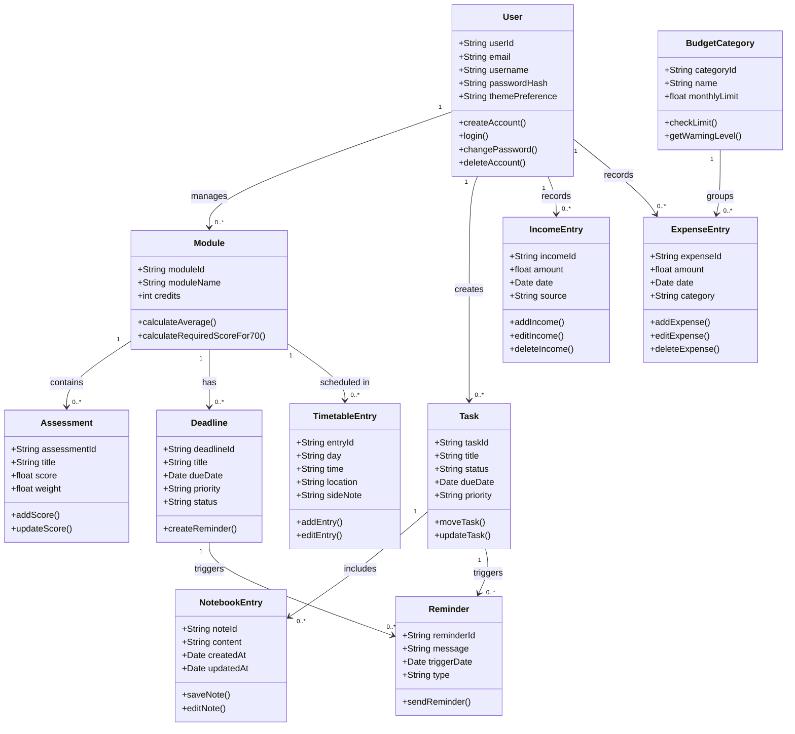

# Class Diagram

## Purpose
This class diagram presents the main structural components of the Student Life Management system. It shows how academic management, finance tracking, and productivity features are organised into related classes. The class diagram was designed from the system requirements so that the application is clear before implementation.

## Why this model was chosen
A class diagram was selected because the project contains several connected data entities, including users, modules, assessments, deadlines, tasks, timetable entries, and finance records. Modelling these relationships helps ensure that the design remains consistent with the requirements and supports maintainable implementation.

## Mermaid Diagram

https://mermaid.live/view#pako:eNqlVm1P2zAQ_iuRP-2lVEmhb_4wiQHTkBhCsGnSlC8mPhKrjt3ZDtCh_vc5L63ixKFM65c0z-PLPXc-3_kFJZICwijhROtzRlJF8lgE9lchwQ8NKnipkfL38c4oJtKgsPgl7eOQE8b9ywXJoc-srZcnqehXorM-azLI4UbBAygQSds8UUAMnCaJLIR5977FcJky4SBJRkQKN40nh6LAofeZbSzaOfgmacHBl4W8Ynx5qJlrN2QmTGB1U2Z0Wx3hScHLYB5BkRRc6TvyFn4XzNreJVLBF6nm4YDaU61B6xysL49ismd9qg0zvC34gUtiAl267KFPwNLMtGBCa3GO_mJNrXgH7-g9B0I5E9780oZ7i9Zz6yegBZRPT5kpJhUzmz6jDTGF7lXWLeRMUFADqr8TvfIpNhZ_i9oh5_8cRS4foRTjyXob7si_lgbupVxdCKM2vjiEXeCLI5HC2OLpKq5zRk97RK3EJTR5hFKAI7k8FW2wm2-WgyH3HAYVQ0n4JFOy8e2HrxlxmRDDpPBsFKOVZrfeKzG9MBy0E8elSGQ-HASraCeK-rSRvGxQvULxVomWhUo6Smu_PakeuO6ILtEJ4uJ5DUK_shU1_59h2K2AVKpNJ-X1t_tJ9-B1KB2mE8vngqZgzhpfvmh2Ony11ZlpdZC5PSMZ31yxnBlnCkGyqkBHpPX-kyhhv3YFj8AHZO7akU-gajjvHLLd3s6UbsYtmaag_F3GbNZtVIOgg92wuh_EKIpRcHT0yf4Lx-MP9qWZmTjIibD-mxbXoJ71ramFqyZDmDhotB8dOMjIwdWdFoLtXMugXEztsXs9mqrb46bLNY4qzLPWba24PNK8oDurIQ_tvoDtjtqBSQ-YOKewY9Op6sPWqZLFujHep9Vjtq9DvKuhA-nwGKARShWjCBtVwAjloOyl0b6iqrZjVF36YoTtX0rUKkax2FqbNRG_pMx3ZlZwmiH8QLi2b_WcaS6w-yVQej4rWw7C0fG8-gbCL-gZ4ZMwGi_ns2i6XITT-SQ8HqENwrNwPF1Ey3C2nM0ni-hksh2hP5XTcLyYROHJcjmdz45nk-U0GqGy70j1rblBl4_tX6YCWLQ

## Mermaid Diagram 

