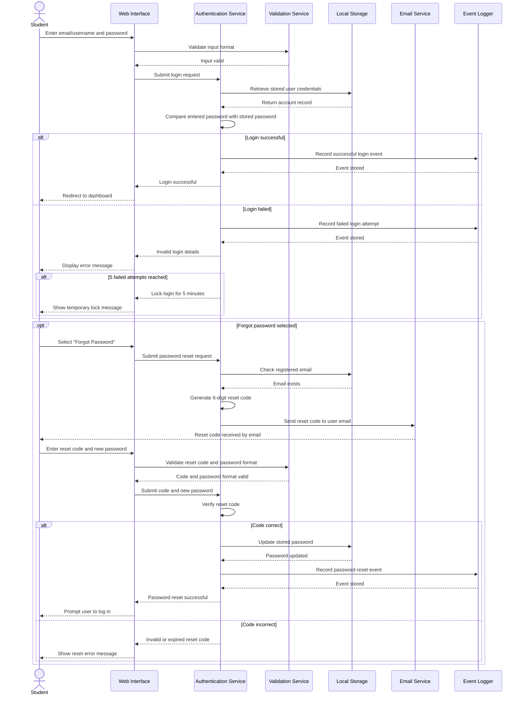

# Sequence Diagrams

## Overview
This file presents two sequence diagrams for the Student Life Management System. These diagrams were selected to represent important behavioural workflows within the system. They show how the student, interface, internal services, and storage components interact over time to complete key tasks.

The two modelled scenarios are:
1. User login and email-based password reset
2. Expense entry and budget summary update

These were chosen because they are strongly linked to the system requirements and demonstrate both core functionality and supporting processes such as validation, storage, calculations, alerts, and user feedback.

## 1. User Login and Email-Based Password Reset

This sequence diagram models the interaction that occurs when a student logs into the system and when a password reset is requested. The password reset process uses a 6-digit code sent to the user’s registered email address, which must then be entered before a new password can be created.

## 1. Mermaid Diagram One Mermaid Link

https://mermaid.live/view#pako:eNqdVl1vmzAU_SuWn9Mu6RJCeag0td0UaZOqRe2kKS8u3BCrYGe2SZtV_e-7_oAAId20vATDuV_n3nvglaYyA5pQDb8qECnccJYrVq4EwR9LjVRkaaoMhPG3tkwZnvItE4bcLwjT5Ac8koUwoNYshWPQp8psLMz-oxeeMsOlIEtQOz6Ef2AFz5iNi0bh8K7BErFgwV9lygp3ZPkA7rZkvLA4f3HS31eZO9QO_CEHtRIeFpg4u7q6XyTk1hZNwHr7UGlQgpWYh8jQm9bPUmXe6H6B-KaqpK4JCBfbypC1VCUL5DaosxBi4SA7e7vlzFKZkGX1WHJDCplzQZRtnw5u7HOEOWIS8h2M4rADou05IzZVkuKV7QYrdF0aPjxrnKNRpQQOQCorpEFB2tQTvHvctSyROyBguYBD6eSZY9tDxAMfYawKRyymras0Ba3XVeGftPwjwKZh47ZgoVzYNQNpf4g9pO4b50P3vAZWT8dGeh1xrs02fMaxdEOMJBnTm0fJahag0BAcrXEAjkJ1C_CQkDwzBsrt_6e_EG4ggrcMDDrXJ2u44XpbsD0BpXCnSqzYbccBb7sxqzMMuWnsOEs37QyOSUyfQgo4wuih5KIyoLsWvWSWG_lMbATcUbVHc_TRpFTbgKg5Fs3IyK0hn6XKpTmMmIYCe9POsbufS_ecrGgwvKvHkHbI6u1T416BBtNdrOPlut4AlqAg59ovgJODdkadtfLSAy-I1kcuPeQLCFBWHqKzjOfchDysTB9ZOHe2UJG1YHZa3ZL3cnHo3nw3NjjmwHdYwOO-tjvFq9e9VjyreQKee7r3rvb1rBvS22o4qIjXJ0zaIjnc2L-k2mnCAyi-3neo7y6MSwNX26rDwI4083G_deUeCWHbojcj9ZiSytlmg-7b4tKb2J42_qPA9Nf7rut0SCwH9vtO4fvA-OnDKUR5wLdca7OtaDrquDhNXk_mUFzgZcstf0OrcEplAhld1RuSGDqiueIZTYyqYERLwHGyR_pqISuKny0lrGiClxlTT1Y93tAGvxV-SlnWZkpW-YYma3yh4sm3LnxLNRAMBuravlBpMvs4dz5o8kpfaDKNL84vp5PxRXwZRfPoIpqO6J4mk8n5OJ5exuPpZBLNJ9H44m1Ef7uw4_PLeBpFs_k0iuPZPJ7FI4qvK2zrN_9F5z7s3v4ApaMpBA

## 1. User Login and Email-Based Password Reset



## 2. Expense Entry and Budget Summary 

This sequence diagram models the process of entering a new expense into the finance management section of the system. It shows how the system validates the entry, saves it in local storage, recalculates totals, checks budget thresholds, and updates the visual summary for the student.

## 2. Mermaid Diagram Two Mermaid Link

https://mermaid.live/view#pako:eNqVVVFr2zAQ_itCMNggLU7aJI4fCl1bRmDbw0JWGHlRpIstJkueJLfNSv_7TpJt0mWhzA-OFX333Xfn7-Rnyo0AWlAHv1rQHG4lKy2rN5rgxbg3lqx8K0D79FfDrJdcNkx7sl4S5sg9bMlSe7A7xuEY9J0pKVjgQWy3kEaTFdgH-a-Aj60owQd09_SFaVaCPUaukBUC8LPhTMUlAo9x1wpsJLxnVktdns59rZna48oF9E2FO-ROl1IjNIG7XpxdXa2XBe5h2QSeGtAOiADPpHLkPatNq_2IYKUwIhzvpbH7D4lhvcTgoSlF3xIgFt-AtCDIToISqEAL8sBUCy4FDjFnXfalblofIFIcUKemFWTVbmvpiYbHXmACpX0Exu4hjj3AUIIFbqzoS8X9swPGuw7kwoboO_I33zfwVgJySs1NDbGM1_TuBD9GtlYT3lqLLcY2aKa5xBeLVbOjdH3UDVO8VaGB3ngE10b7Su37nO7NsP79DCojz6kwU6NfDoJSUm_INplVSex6L5Ypj4k6pAXGK3Akz94Rs-vwCfcqVXRrQT6BBhv0PXamrcG5wd7hisDeDLfSNYrtIzsLGwkHCgs6kjDO_lMDPHEAgd7sxLwhYoCfVLIFZR6Jryy4yihxJKEj_GqG8vvx6Nj0sQGH4S3IuhFJdjeZ0qEpt208eIIhOXMV2QUJyVuxkj68T975sY1cGBOPg8OJxHmLvo9HAk5ShXw9OvrCjVIHwi9mbSQkFjqipZWCFt62MKI12JqFJX0OxBvqK6hhQwt8FMz-3NCNfsEYPKJ-GFP3Yda0ZUWLHebBVUrcHd8DBPsE9iYcR7SYXEwjBy2e6RMtxvPF-Ty7mI9ni8ViOsnyfET3tJifz6Z5Pr9Y5NnlOJ9Mpi8j-jtmzc4X-Ty_nGaz6XR2mefIBkLiFH9Jn5D4JXn5A7G6Hew

## 2. Mermiad Diagram Two 

```Mermaid
sequenceDiagram
    actor Student
    participant UI as Web Interface
    participant Validator as Validation Service
    participant Budget as Budget Manager
    participant Store as Local Storage
    participant Alert as Warning Service
    participant Analytics as Chart Engine

    Student->>UI: Enter expense details (amount, date, category)
    UI->>Validator: Validate required fields and values
    Validator-->>UI: Input valid
    UI->>Budget: Submit new expense
    Budget->>Store: Save expense record
    Store-->>Budget: Expense stored

    Budget->>Store: Retrieve income and expense records
    Store-->>Budget: Return current financial data

    Budget->>Budget: Calculate total monthly expenses
    Budget->>Budget: Calculate category expense total
    Budget->>Budget: Compare category total to budget limit

    alt Category reaches 80% of budget
        Budget->>Alert: Generate warning message
        Alert-->>UI: Display 80% alert
    else Category reaches 100% of budget
        Budget->>Alert: Generate exceeded warning
        Alert-->>UI: Display exceeded alert
    else Category below threshold
        Budget-->>UI: No warning required
    end

    Budget->>Analytics: Update expense distribution and cash flow data
    Analytics-->>UI: Return updated chart values
    UI-->>Student: Show updated totals, alerts, and pie chart
```