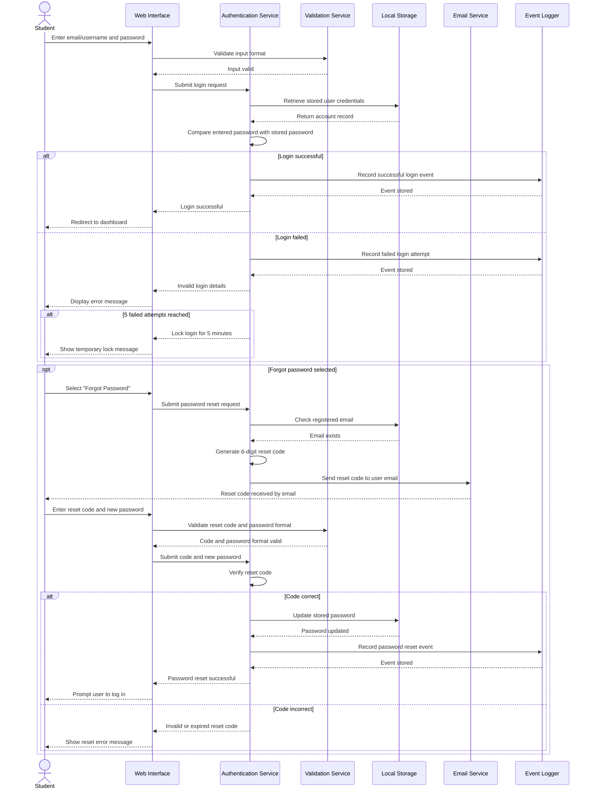
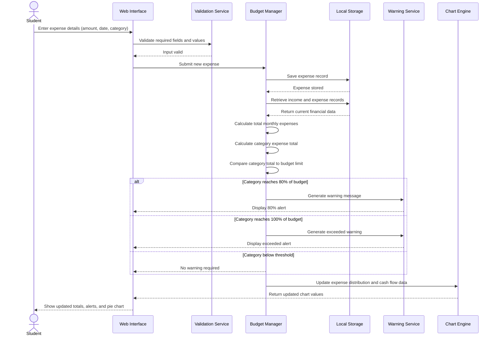

# Sequence Diagrams

## Overview
This file presents two sequence diagrams for the Student Life Management System. These diagrams were selected to represent important behavioural workflows within the system. They show how the student, interface, internal services, and storage components interact over time to complete key tasks.

The two modelled scenarios are:
1. User login and email-based password reset
2. Expense entry and budget summary update

These were chosen because they are strongly linked to the system requirements and demonstrate both core functionality and supporting processes such as validation, storage, calculations, alerts, and user feedback.

## 1. User Login and Email-Based Password Reset

This sequence diagram models the interaction that occurs when a student logs into the system and when a password reset is requested. The password reset process uses a 6-digit code sent to the user’s registered email address, which must then be entered before a new password can be created.

## 1. User Login and Email-Based Password Reset

## 2. Expense Entry and Budget Summary 

This sequence diagram models the process of entering a new expense into the finance management section of the system. It shows how the system validates the entry, saves it in local storage, recalculates totals, checks budget thresholds, and updates the visual summary for the student.

## 2. Mermiad Diagram Two 

