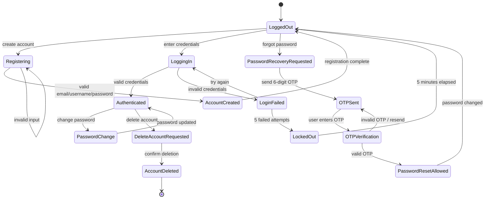
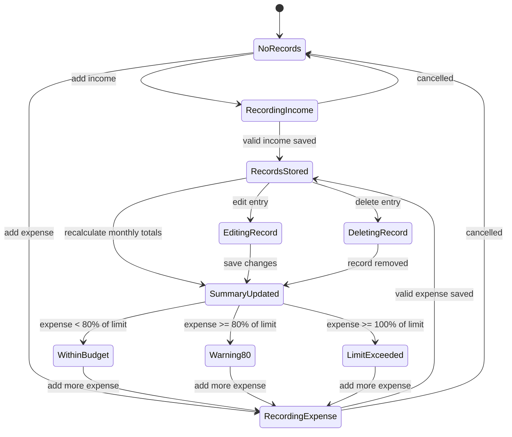
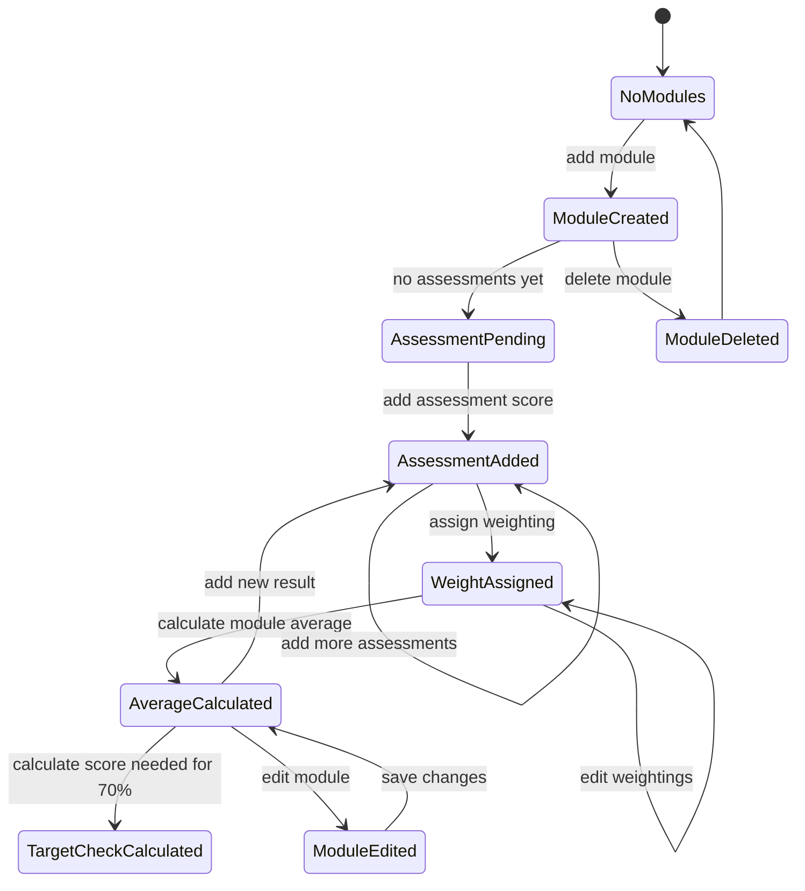
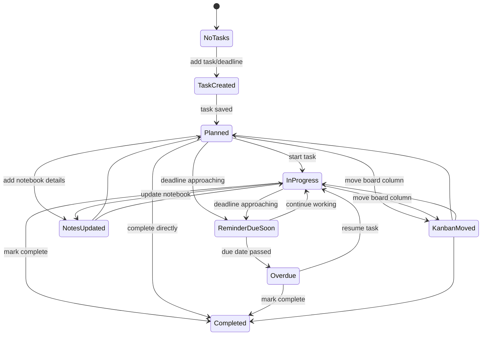

# State Diagrams

## Overview
This section presents the state diagrams for the Student Life Management System. State diagrams were used to model the dynamic behaviour of the system by showing how key features change between different states based on user actions, validation checks, and system rules.

These diagrams were selected to support features with clear event-driven behaviour, such as user authentication, password recovery, financial budget alerts, academic tracking, and task progression. They also help connect the requirements to expected system behaviour before implementation.

## State Diagram 1: User Authentication and Password Recovery

### State Diagram 1 

This diagram models the lifecycle of a user account from registration to authentication and recovery. It reflects the requirements for account creation, login validation, password strength enforcement, OTP-based password recovery, temporary lockout after repeated failed login attempts, and permanent account deletion. This was important to model because the authentication feature contains multiple security-related transitions and error states.

## State Diagram 2: Finance Tracking and Budget Alerts

    
### State Diagram 2

This diagram shows how the finance system changes state when a user records, edits, or deletes income and expense entries. It also includes budget monitoring behaviour by showing transitions between normal spending, warning level, and limit exceeded states. This supports the budgeting and alert logic required by the finance manager.

## State Diagram 3: Module and Grade Tracking

### State Diagram 3

This diagram models the states involved in academic module tracking. It begins with module creation and progresses through assessment entry, weighting configuration, average grade calculation, and distinction target analysis. It helps represent how the academic performance feature supports both record keeping and goal setting.

## State Diagram 4: Task and Deadline Management

### State Diagram 4

This diagram shows the task lifecycle within the productivity area of the system. It includes task creation, Kanban progression, note-taking, reminders, and overdue status transitions. This is useful because the task system is heavily based on workflow state changes and deadline monitoring.