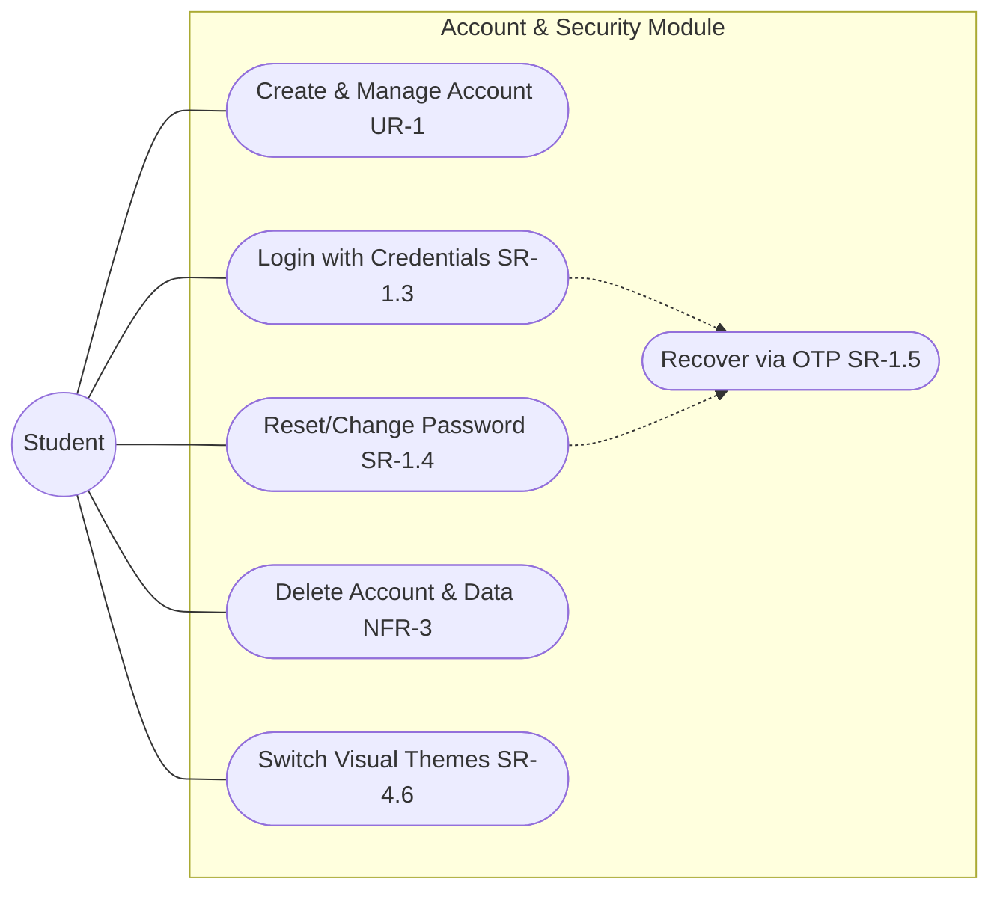
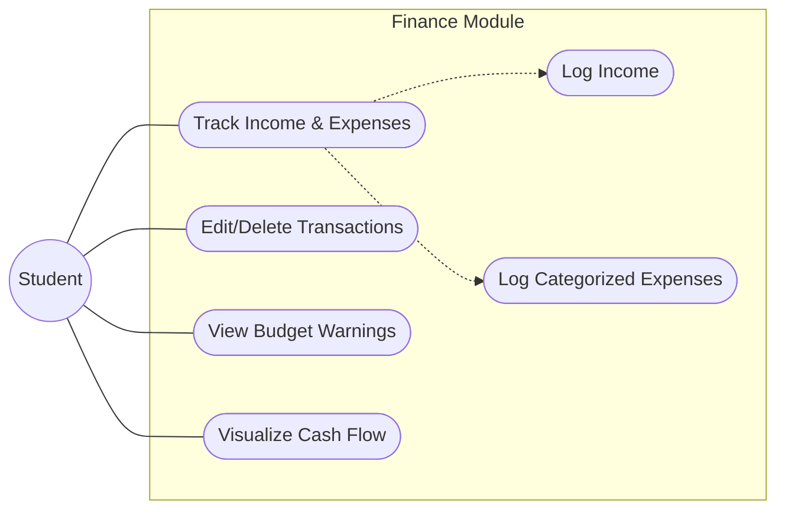
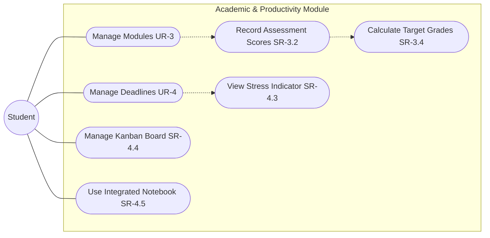

# Use Case Documentation

## Overview
 
This document details the use case model for the Student Life Management system. The sole primary actor is the **Student**, who interacts with three functional modules: Account & Security, Financial Management, and Academic & Productivity. Each use case is mapped to its corresponding functional requirement (FR) or non-functional requirement (NFR) where applicable.

## Actors
 
| Actor | Type | Description |
|---|---|---|
| Student | Primary | An authenticated university student using the SLM application to manage finances, academics, and productivity. |
| System | Secondary | The Flask backend that enforces business rules, validates data, and persists records to JSON storage. |

## Module 1 — Account & Security
 

 
> **Legend:** `-.->` denotes an **«include»** relationship — the source use case always triggers the target.

**Account & Security**
This module handles the full lifecycle of a student's account. A student can register with credentials, log in to receive a JWT token, and recover access through a one-time passcode if their password is forgotten or their account is locked — OTP verification is a shared step embedded in both the login recovery and password reset flows. Once inside, students can change their password, switch between visual themes, or permanently delete their account and all associated data, satisfying the system's data-privacy requirements.

## Module 2 — Financial Management
 

 
> **Legend:** `-.->` denotes an **«include»** relationship — UC7 always triggers both UC8 and UC9 as sub-flows.

**Financial Management**
This module gives students visibility and control over their personal finances. The core flow centres on tracking transactions — logging income and categorised expenses — which feeds into a running balance maintained by the backend. Students can edit or delete any prior transaction, and the system automatically raises budget warnings whenever spending in a category breaches a configured limit. A cash flow visualisation then surfaces all of this data as an interactive chart, giving students a clear picture of their financial health over time.

## Module 3 — Academic & Productivity
 

 
> **Legend:** `-.->` denotes an **«include»** relationship — managing modules always enables assessment recording, and recording assessments always enables grade calculation.
 
**Academic & Productivity**
This module brings together the tools students need to stay on top of their studies and workload. Modules are the foundation: once created, they unlock assessment recording, which in turn automatically calculates the minimum score needed in remaining work to hit a target grade. On the task management side, deadlines feed directly into a stress indicator that updates in real time to reflect workload pressure. Alongside these, students have a Kanban board for organising tasks across stages and a distraction-free integrated notebook for capturing notes — all persisted across sessions.